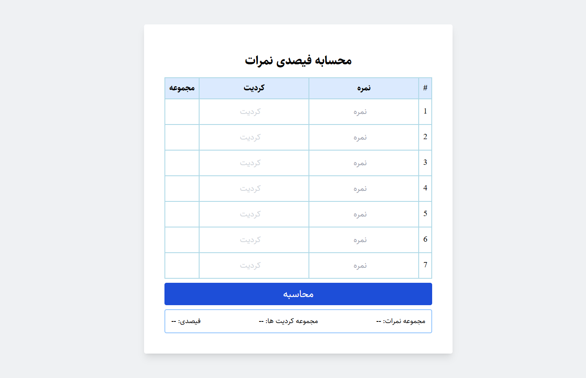

# Score percentage calculator app

## Overview

Users are able to:

- View there total score, total credits and score percentage after submitting the score and credits for all subjects
- View the optimal layout for the interface depending on their device's screen size
- See hover and focus states for all interactive elements on the page

### Screenshot

### Links

- Live Site URL: (https://score-percentage-calculator.vercel.app/)

### Built with

- Semantic HTML5 markup
- CSS custom properties
- Flexbox
- Mobile-first workflow
- [React](https://reactjs.org/) - JS library

## Author

- Frontend Mentor - [@abdulalisadaqat](https://www.frontendmentor.io/profile/abdulalisadaqat)
- Linkedin - [@abdulalisadaqat](https://www.linkedin.com/in/abdulalisadaqat)
- Github - [@abdulalisadaqat](https://github.com/abdulalisadaqat)
